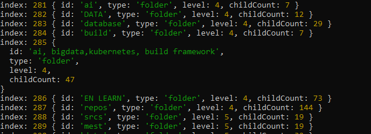
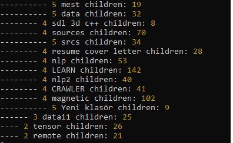

The library can basically parse browser bookmarks and folder hieararchy

- Import / Export Netscape (Google Chrome)
- Folder Hierarchy bidirectional conversion as JSON
- Advanced array formats

## Installation
`npm i mustaft0k/treefy`

## Documentation

