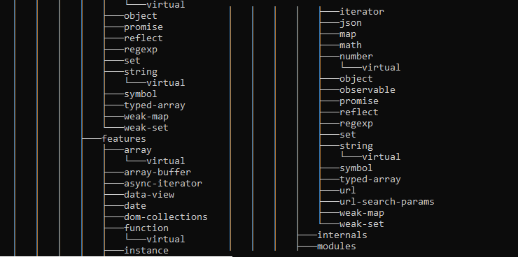

The library can basically parse browser bookmarks and folder hieararchy

- Import / Export Netscape (Google Chrome)
- Folder Hierarchy bidirectional conversion as JSON
- Advanced array formats

## Installation
`npm i mustaft0k/treefy`

## Documentation

## Examples
- [Nested](https://github.com/mustafat0k/treefy/tree/main/examples/nested)
- [Chrome Export](https://github.com/mustafat0k/treefy/tree/main/examples/chrome-export)
- [Xml2Json](https://github.com/mustafat0k/treefy/tree/main/examples/xml2json)

